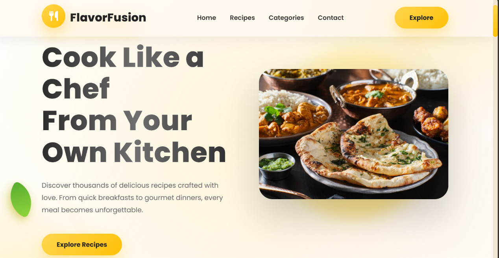
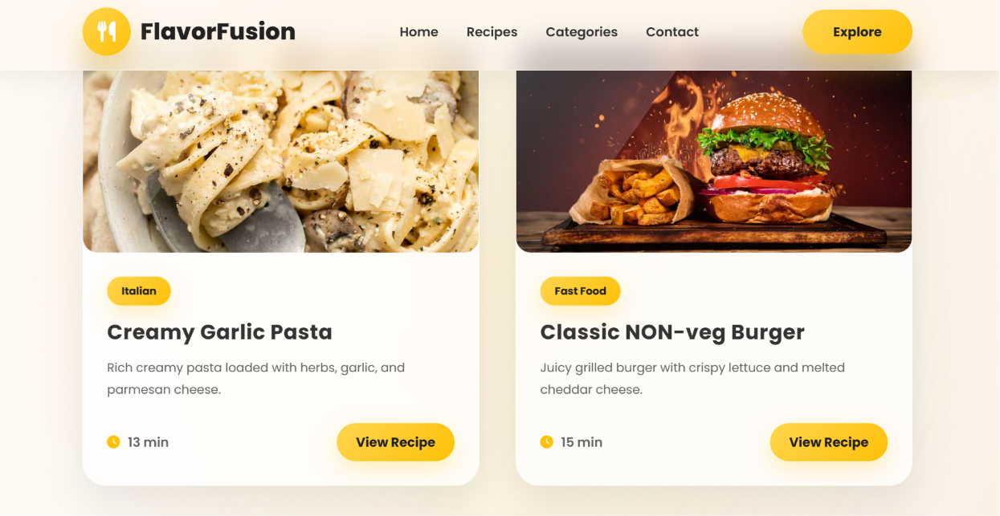
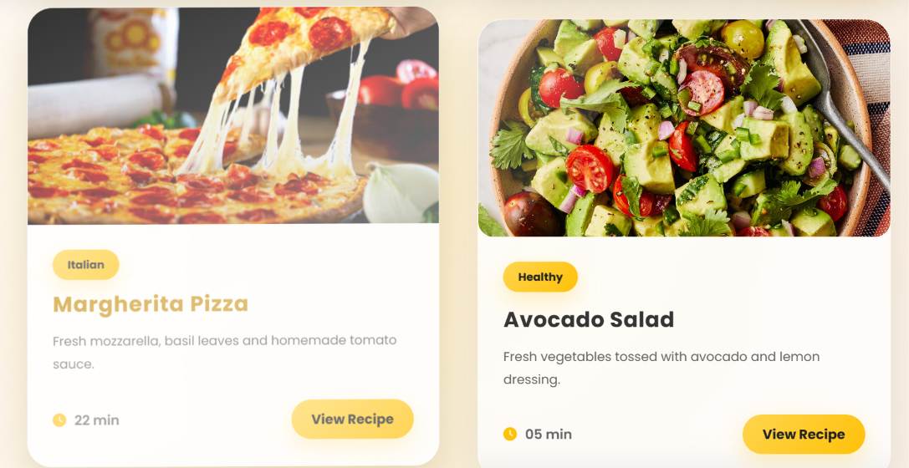

# 🍽️ Flavour Fusion - Recipe Website

<p align="center">
  
  
  
  
</p>

A modern and responsive recipe website built using **HTML5** and **CSS3**. The project features an elegant user interface, recipe cards, food categories, a newsletter subscription section, and a fully responsive layout that provides an engaging experience across desktop and mobile devices.

---

## 🚀 Live Demo

🔗 **https://krish1921.github.io/Flavour-fusion-recipe-website/**

---

## ✨ Features

- 🍕 Modern & Attractive UI
- 📱 Fully Responsive Design
- 🎨 Pure HTML5 & CSS3
- 🍽️ Featured Recipe Cards
- 🥗 Food Categories
- 🔍 Smooth Navigation
- 💌 Newsletter Subscription
- 📞 Contact Section
- 🌐 Cross Browser Compatible
- 💻 Beginner Friendly Project

---

## 🛠️ Technologies Used

- HTML5
- CSS3
- Flexbox
- CSS Grid
- Responsive Design

---

# 📸 Screenshots

## 🏠 Home Page



---

## 🍽️ Featured Recipes



---

## 📱 Responsive Layout



---

## 📂 Project Structure

```text
Flavour-fusion-recipe-website/
│
├── assets/
│   ├── image-1.png
│   ├── image-2.png
│   └── image-3.png
│
├── index.html
├── style.css
└── README.md
```

---

## 🎯 What I Learned

- Semantic HTML5
- Advanced CSS Styling
- Flexbox & CSS Grid
- Responsive Web Design
- UI Layout Design
- Git & GitHub Workflow
- GitHub Pages Deployment

---

## 👨‍💻 Author

**Krish Kumar**

GitHub: https://github.com/krish1921

---

### ⭐ If you found this project helpful, consider giving it a star on GitHub!
